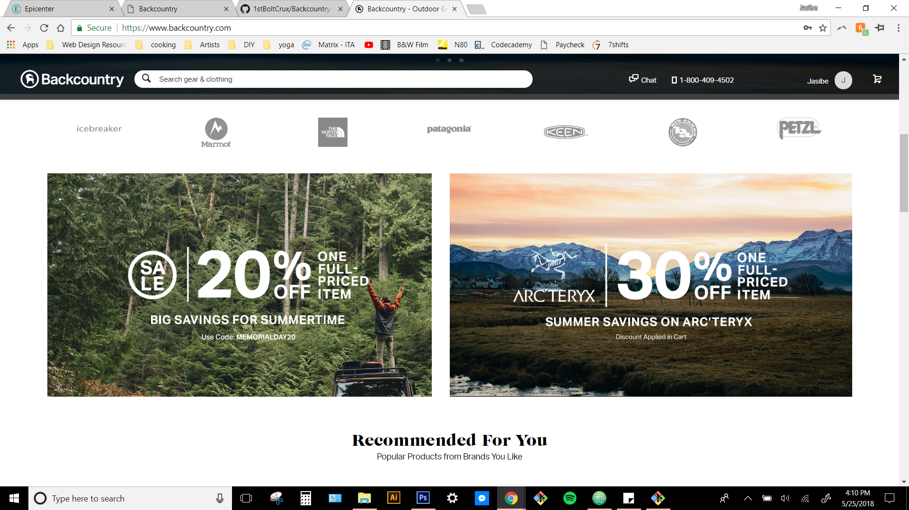
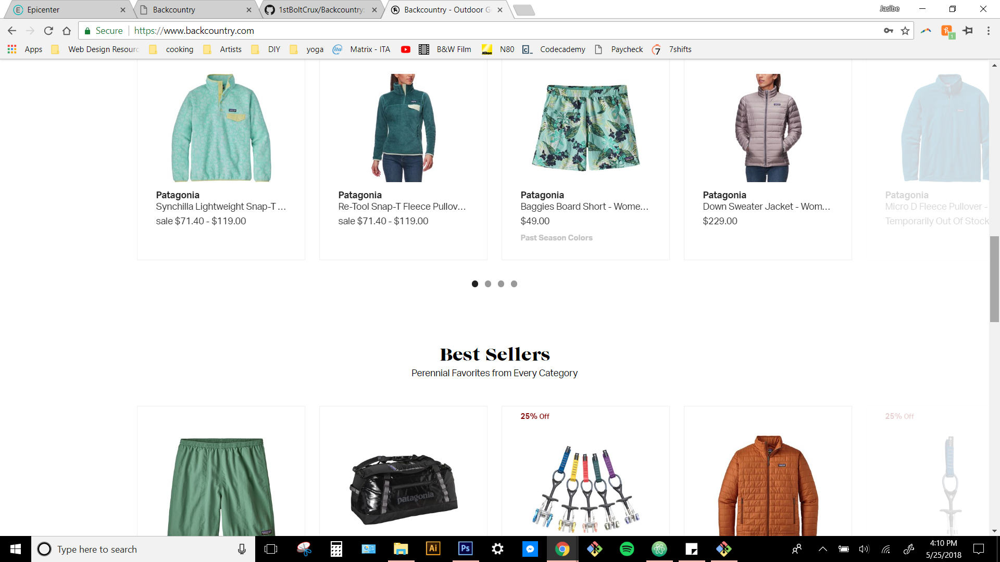

# Backcountry

By Ted Leary.

## Description

Backcountry is a CSS design mockup of the marketplace website Backcountry.com.

### Setup/Installation

repository can be cloned from github: https://github.com/1stBoltCrux/Backcountry.git

## Backcountry.Com screenshots

# Screenshots of the Backcountry.com cloned

## Technologies Used

* HTML
* CSS

## License

This software is licensed under the MIT license

Copyright (c) 2018 **Ted Leary**